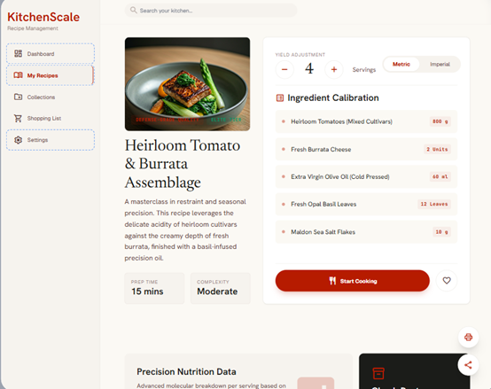
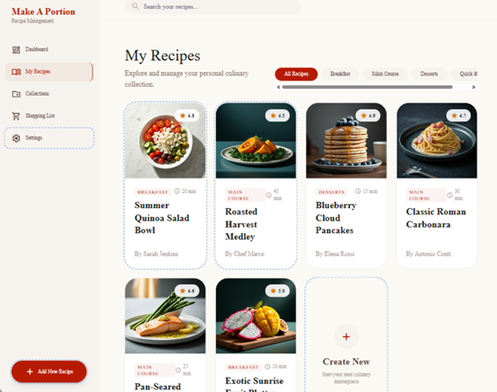
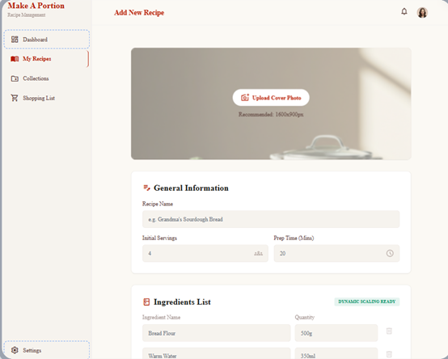
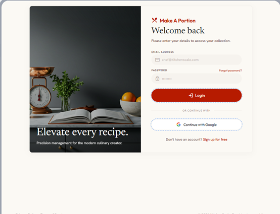
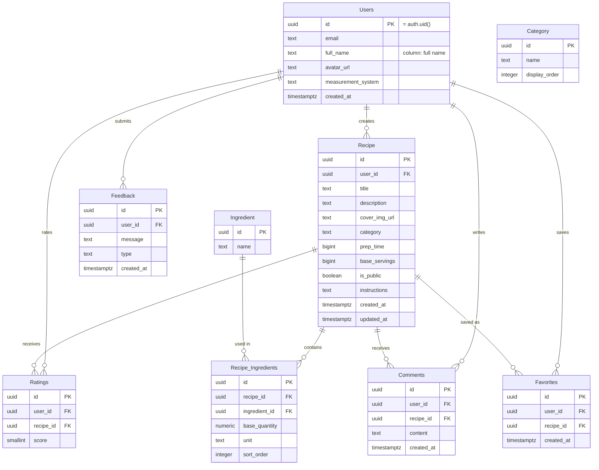

# 🍲 Make A Portion

> A Hebrew-first home-cooking recipe manager — save a recipe once, automatically scale ingredient amounts to the number of servings, convert measurement units, and get help from an AI chef while you cook.

**🔗 Live site (Vercel):** https://make-a-portion.vercel.app
**💻 Repository:** https://github.com/ItayShaby/Make-A-Portion


---

## 👤 Demo user (for testing)

To test the full flow (favorites, ratings, adding a recipe, AI chef) you can log in with:

| Field | Value |
|-------|-------|
| Email | `test@mail.com` |
| Password | `Test123456` |

Alternatively, sign in / sign up with one click using **Google**. Browsing recipes (Discover) is available without logging in.

---

## ✨ Overview

**Make A Portion** is a web app for managing and consuming recipes. Users can browse a shared recipe library, save recipes to favorites, add their own recipes, rate and comment — and most importantly: **scale ingredient amounts to the desired number of servings with one click**, and convert between metric and imperial units (including oven temperatures). On top of that, an **AI chef powered by Google Gemini** answers cooking questions and suggests recipes.

## 📸 Screenshots

<p align="center">
  
  &nbsp;
  
</p>
<p align="center">
  
  &nbsp;
  
</p>

## 🎯 The problem it solves

Home cooking is messy: recipes are scattered across phone screenshots, "save to self" WhatsApp messages, ad-heavy recipe sites and sticky notes. When you want to cook a recipe written for 6 but you're cooking for 2, you have to recalculate amounts by hand; when a recipe is in ounces and Fahrenheit, you have to convert; and when you get stuck mid-cook ("what can I substitute for butter?") there's no one to ask. **Make A Portion brings it all into one organized, Hebrew, free place.**

## 👥 Target audience

Hebrew-speaking home cooks — beginners and experienced alike — who want a single, organized place to collect recipes, scale portions to the number of diners at a meal, and get instant help while cooking, without distractions and ads.

## ⚔️ Competitors & differentiation

| Existing solution | Drawback | How we're different / better |
|-------------------|----------|------------------------------|
| **Manual methods** (screenshots, WhatsApp "save", notes, Excel) | Scattered, not searchable, no portion scaling | One organized library with search, favorites and automatic portion scaling |
| **Recipe websites** (Mako/Ochel, etc.) | Ad-heavy, not personal, inconvenient units | Clean full-Hebrew (RTL) UI, no ads, one-click unit conversion |
| **Recipe apps** (Paprika, Cookpad, etc.) | Mostly English, paid, no built-in AI | Free, full RTL, **built-in AI chef**, Google sign-in |

**Core differentiator:** smart portion scaling by number of servings + unit & temperature conversion + an AI chef — inside a clean, fully Hebrew interface.

## 🧩 Key features

- 🔐 **Authentication** — email/password + sign-in/sign-up with **Google OAuth**.
- 🔎 **Discover** — browse all recipes, filter by category, search, and favorite with a heart.
- 📖 **Recipe page** — ingredients, preparation steps, and a **servings stepper** that scales amounts in real time.
- 🔁 **Unit conversion** — metric ↔ imperial, including temperature conversion (°C ↔ °F) inside the instructions.
- ⭐ **Ratings & comments** — average star rating + comments on each recipe.
- ➕ **Personal recipe management** — add and edit recipes and ingredients, including image upload.
- 🤖 **AI chef (Gemini)** — a Hebrew chat for cooking questions, ingredient substitutions and recipe suggestions.
- 💬 **Feedback widget** — logged-in users send feedback that is stored in Supabase.

## 🛠️ Tech stack

- **Frontend:** React 19, Vite 8, React Router 7
- **Backend / DB:** Supabase (PostgreSQL, Auth, Storage, Row-Level Security, Edge Functions)
- **AI:** Google Gemini (`gemini-2.5-flash`) via a Supabase Edge Function
- **Hosting / CI:** Vercel (auto-deploy from GitHub) + GitHub Actions (Vitest)
- **Observability:** Vercel Analytics, Microsoft Clarity, Sentry

## ▶️ Running locally

The application code lives in the `make-a-portion/` folder:

```bash
git clone https://github.com/ItayShaby/Make-A-Portion.git
cd Make-A-Portion/make-a-portion
npm install

# Create a .env file with your public Supabase keys:
#   VITE_SUPABASE_URL=...
#   VITE_SUPABASE_ANON_KEY=...

npm run dev      # development server
npm run build    # production build
npm run test     # integration tests (Vitest)
```

> Secret keys (such as the Gemini key) are **not** in the client-side code — they are stored as Secrets in Supabase and read only inside the Edge Function.

---

## 🗺️ Data model (ERD)

The schema is managed in Supabase (PostgreSQL). The diagram shows the tables, columns and types, primary keys (PK) and foreign keys (FK), and the relationships between them:



> Notes: in the database the junction table is named `"Recipe-Ingredients"` (shown here as `Recipe_Ingredients` due to a character limitation in the diagram). `Category` is a standalone reference table; `Recipe.category` is stored as text. All tables are protected by **Row-Level Security (RLS)** — for example, a user can edit only their own recipes, and feedback can be inserted but not read by other users.

---

## 🌐 External services & integrations

| Service | Type | What it's used for |
|---------|------|--------------------|
| **Supabase Auth** | Authentication | User management and email/password sign-in |
| **Google OAuth** | Authentication | One-click sign-in and sign-up via a Google account |
| **Supabase (PostgreSQL + RLS)** | Database | Storing recipes, ingredients, ratings, comments, favorites and feedback, with row-level access control |
| **Supabase Storage** | File storage | Uploading recipe images and profile pictures (avatars) |
| **Supabase Edge Function** | Server logic | Secure calls to the Gemini API and hiding the API key from the client |
| **Google Gemini API** | API call (AI) | The AI chef: cooking questions, ingredient substitutions and recipe suggestions |
| **Vercel** | Deployment / Hosting | Hosting the live site and automatic deployment (CI/CD) from GitHub |
| **Vercel Analytics** | Analytics | Site traffic and usage data |
| **Microsoft Clarity** | Analytics / recordings | Heatmaps and anonymous session recordings |
| **Sentry** | Error monitoring | Capturing production JavaScript errors with stack traces |
| **Unsplash** | Images | Freely-licensed dish photos for recipes |

---

## 🔒 Security

- Secret keys (Gemini) are stored as **Supabase Secrets** and read only inside an **Edge Function** — never in client-side code.
- **Row-Level Security (RLS)** is enabled on the tables to restrict reads and writes per the logged-in user.
- Environment files (`.env`, `.env.*`) are in `.gitignore` — they are never committed to the repo.

---

## 🎨 Design

The design system (color palette, typography and design tokens) is documented in [`DESIGN.md`](DESIGN.md).
